# Домашнее задание к занятию "Уязвимости и атаки на информационные системы" - Сергеев Александр


### Инструкция по выполнению домашнего задания

   1. Сделайте `fork` данного репозитория к себе в Github и переименуйте его по названию или номеру занятия, например, https://github.com/имя-вашего-репозитория/git-hw или  https://github.com/имя-вашего-репозитория/7-1-ansible-hw).
   2. Выполните клонирование данного репозитория к себе на ПК с помощью команды `git clone`.
   3. Выполните домашнее задание и заполните у себя локально этот файл README.md:
      - впишите вверху название занятия и вашу фамилию и имя
      - в каждом задании добавьте решение в требуемом виде (текст/код/скриншоты/ссылка)
      - для корректного добавления скриншотов воспользуйтесь [инструкцией "Как вставить скриншот в шаблон с решением](https://github.com/netology-code/sys-pattern-homework/blob/main/screen-instruction.md)
      - при оформлении используйте возможности языка разметки md (коротко об этом можно посмотреть в [инструкции  по MarkDown](https://github.com/netology-code/sys-pattern-homework/blob/main/md-instruction.md))
   4. После завершения работы над домашним заданием сделайте коммит (`git commit -m "comment"`) и отправьте его на Github (`git push origin`);
   5. В личном кабинете прикрепите и отправьте ссылку на решение в виде md-файла в вашем Github.
   6. Любые вопросы по выполнению заданий спрашивайте в разделе “Вопросы по заданию” в личном кабинете.
   
Желаем успехов в выполнении домашнего задания!
   
### Дополнительные материалы, которые могут быть полезны для выполнения задания

1. [Руководство по оформлению Markdown файлов](https://gist.github.com/Jekins/2bf2d0638163f1294637#Code)

---

### Задание 1

Скачал виртуальную машину Metasploitable https://sourceforge.net/projects/metasploitable/ и запустил ВМ в VBox.
Это типовая ОС для экспериментов в области информационной безопасности, с которой следует начать при анализе уязвимостей.

Просканировал ВМ Metasploitable, используя nmap. Определил список и версии сетевых служб ВМ:
```
nmap -p- -sV 192.168.50.114
```

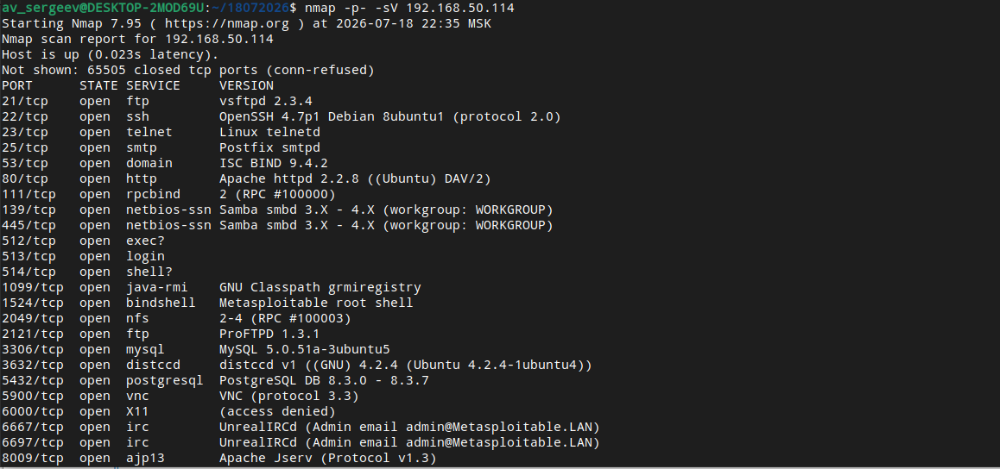
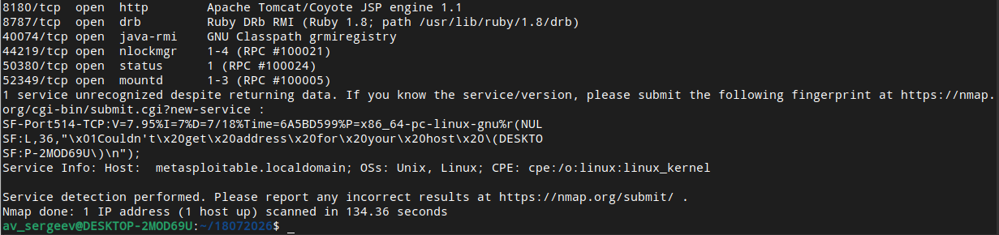

В списке уязвимостей сайта https://www.exploit-db.com/ нашел несколько уязвимостей, которым подвержена эта ВМ.
Для этого в поиске ввел название сетевой службы, обнаруженной на ВМ, и выбрал подходящие по версии уязвимости:
- vsftpd 2.3.4 - Backdoor Command Execution https://www.exploit-db.com/exploits/49757 (выполнение команд через бэкдор);
- Oracle MySQL < 5.1.50 - Privilege Escalation https://www.exploit-db.com/exploits/34796 (повышение привилегий);
- OpenSSH < 7.7 - User Enumeration (2) https://www.exploit-db.com/exploits/45939 (перечисление пользователей).

---

### Задание 2

Провел сканирование Metasploitable в режимах SYN, FIN, Xmas, UDP и запишите сеансы сканирования в Wireshark.

SYN

Сканировал ВМ Metasploitable в режиме SYN:
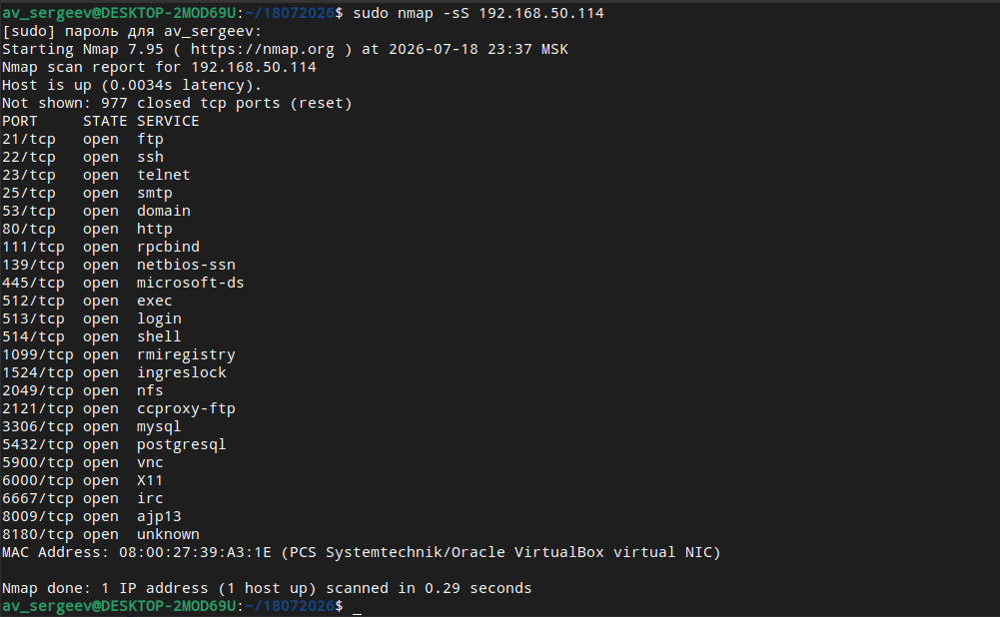

В wireshark отфильтровал TCP пакеты: ip.addr == 192.168.50.114 and tcp and tcp.port == 445.
nmap направил пакет SYN на удаленный порт 445, получил пакет SYN,ACK (готовность соединения) и сбросил соединение
ответным пакетом RST. Так как со стороны сервера была готовность соединения, то nmap решил, что порт 445 слушает
сетевая служба (т. е. порт открыт).

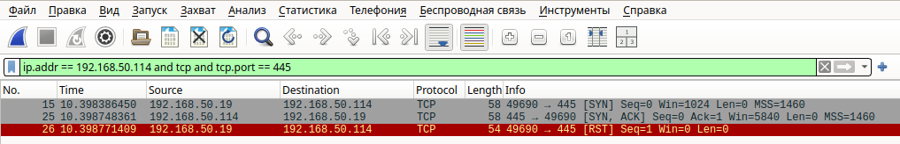

В wireshark отфильтровал TCP пакеты: ip.addr == 192.168.50.114 and tcp and tcp.port == 143.
nmap направил пакет SYN на удаленный порт 143 и получил пакет RST,ACK. Поэтому nmap решил, что порт 143 не слушает
сетевая служба (т. е. порт закрыт).

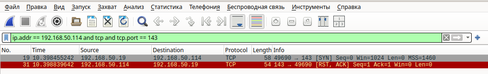


FIN

Сканировал ВМ Metasploitable в режиме FIN:
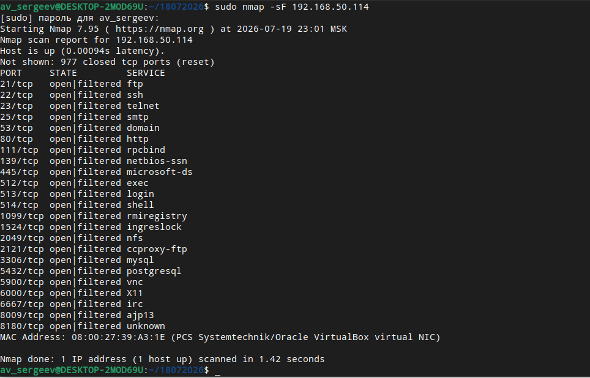

В wireshark отфильтровал TCP пакеты: ip.addr == 192.168.50.114 and tcp and tcp.port == 445.
nmap направил два пакета FIN на удаленный порт 445 и не получил ответов. Поэтому nmap решил, что порт 445 слушает
сетевая служба (т. е. порт открыт).

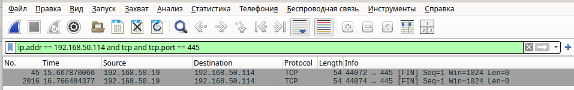

В wireshark отфильтровал TCP пакеты: ip.addr == 192.168.50.114 and tcp and tcp.port == 143.
nmap направил пакет FIN на удаленный порт 143 и получил пакет RST,ACK. Поэтому nmap решил, что порт 143 не слушает
сетевая служба (т. е. порт закрыт).

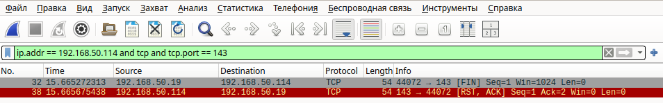


Xmas

Сканировал ВМ Metasploitable в режиме Xmas:
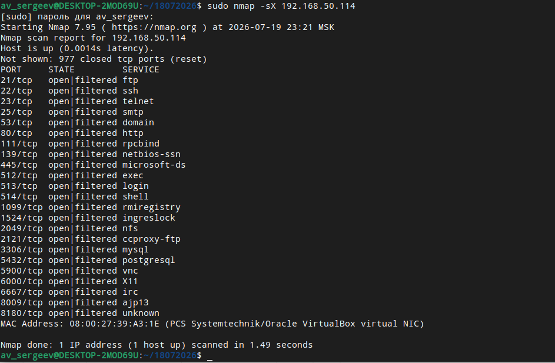

В wireshark отфильтровал TCP пакеты: ip.addr == 192.168.50.114 and tcp and tcp.port == 445.
nmap направил два пакета с флагами FIN, PSH, URG на удаленный порт 445 и не получил ответов. Поэтому nmap решил,
что порт 445 слушает сетевая служба (т. е. порт открыт).

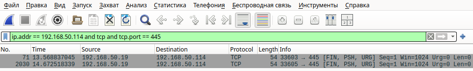

В wireshark отфильтровал TCP пакеты: ip.addr == 192.168.50.114 and tcp and tcp.port == 143.
nmap направил пакет с флагами FIN, PSH, URG на удаленный порт 143 и получил пакет RST,ACK. Поэтому nmap решил, что
порт 143 не слушает сетевая служба (т. е. порт закрыт).

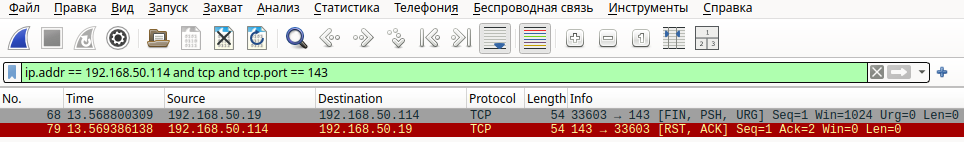


UDP

Сканировал ВМ Metasploitable в режиме UDP:
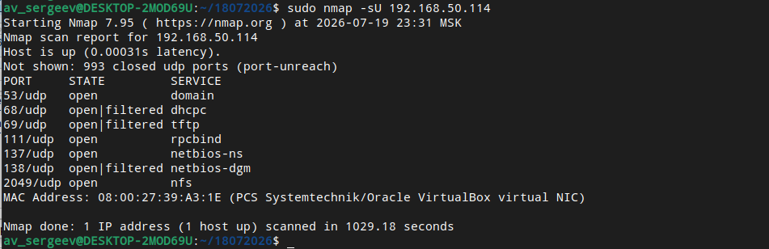

Сканирование выполняется почти в тысячу раз медленнее предыдущих методов.
В wireshark отфильтровал UDP пакеты: ip.addr == 192.168.50.114 and udp and udp.port == 68.
nmap направил десять пакетов на удаленный порт 68 и не получил ни одного ответного пакета. Поэтому nmap решил,
что UDP порт 68 фильтрован или его слушает сетевая служба (т. е. порт открыт/фильтрован).

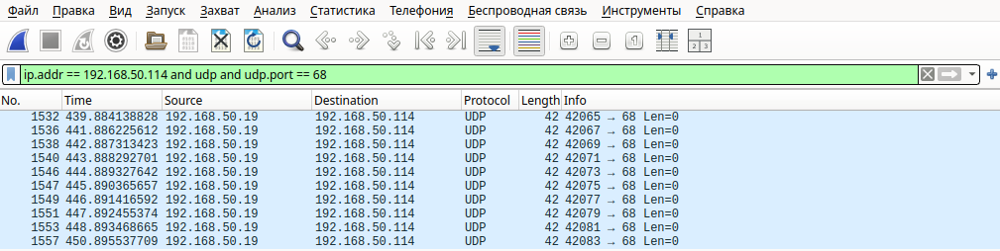

В wireshark отфильтровал TCP пакеты: ip.addr == 192.168.50.114 and udp and udp.port == 434.
nmap направил один пакет на удаленный порт 434 и получил один ответный пакет Destination unrecheable. Поэтому nmap
решил, что UDP порт 434 закрыт (т. е. порт закрыт).

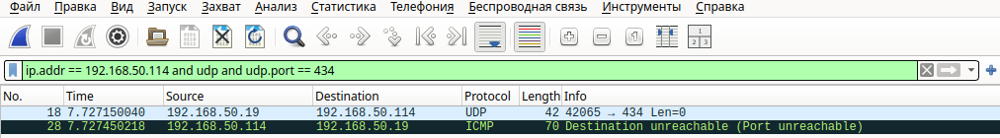

Однако, в некоторых случаях UDP сканирования логика работы nmap отличается от вышеуказанной.


Вывод.

Режимы сканирования с точки зрения сетевого трафика отличаются разными сетевыми протоколами транспортного уровня
(TCP для SYN, FIN, Xmas методов сканирования и UDP для UDP метода сканирования), а также размером и скоростью трафика.
